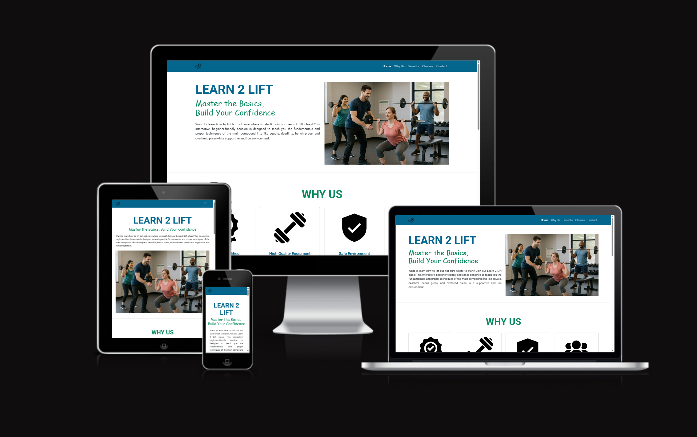
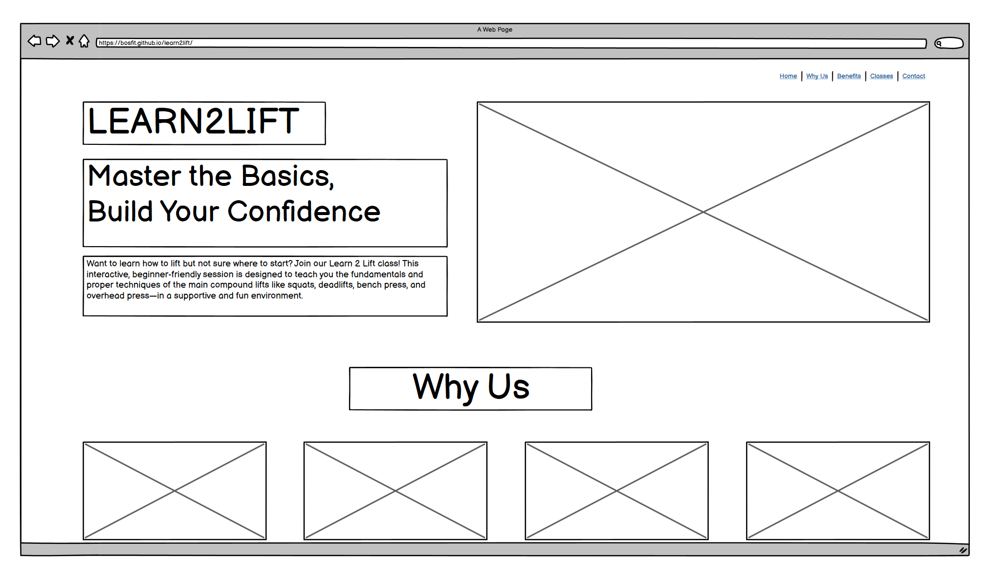
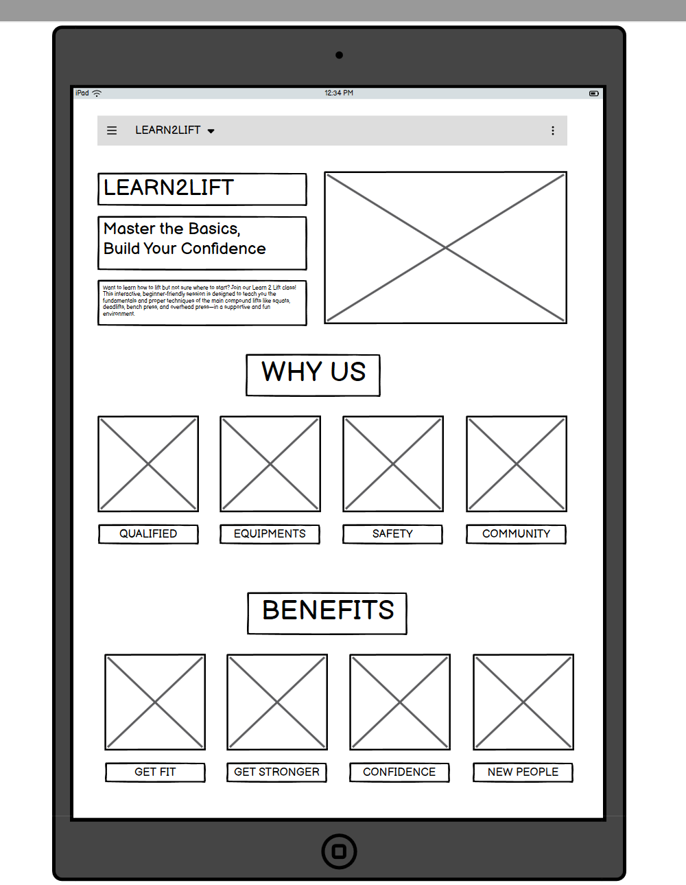
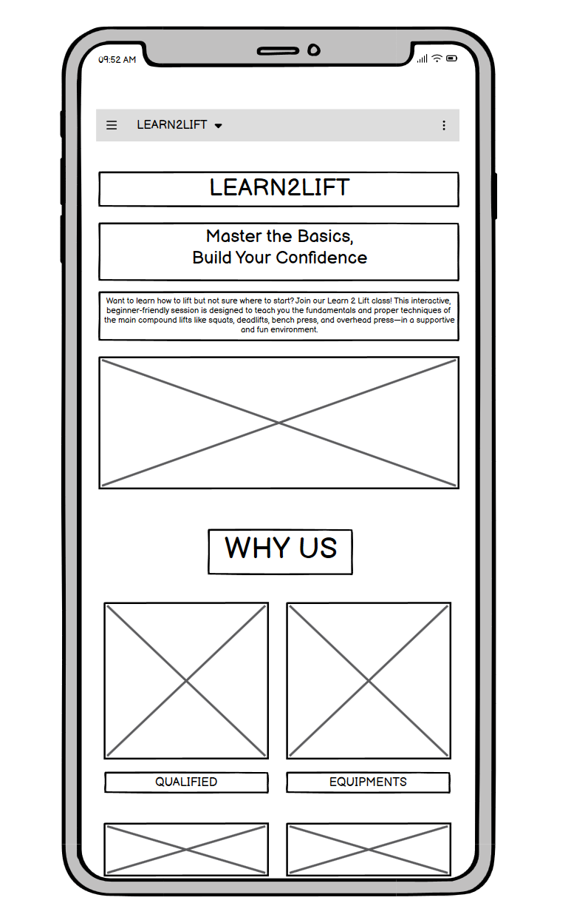
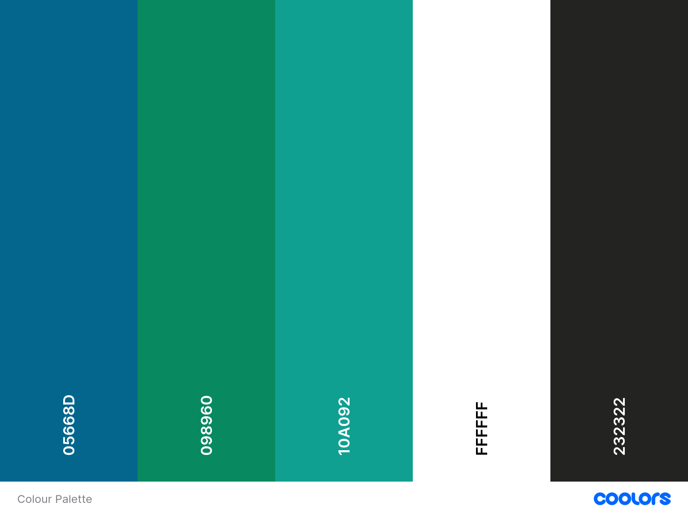
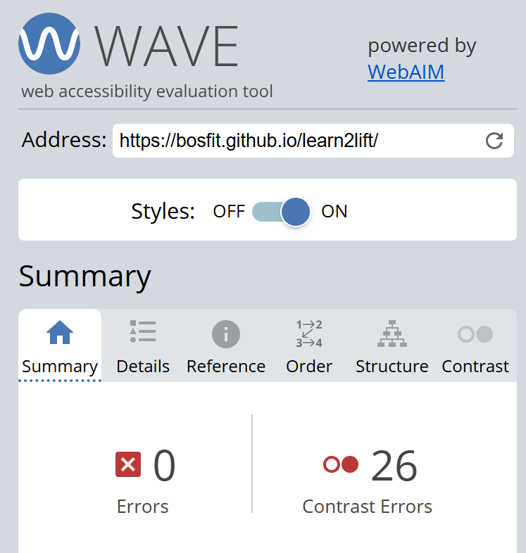
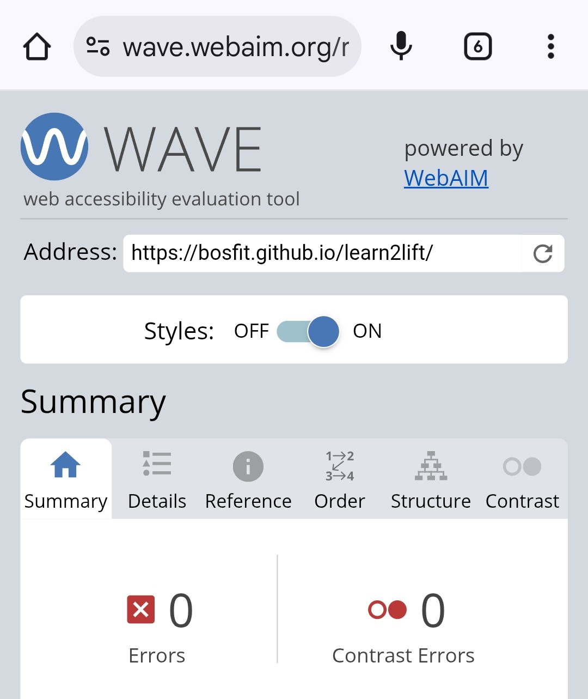
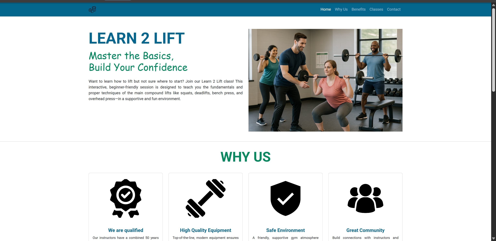
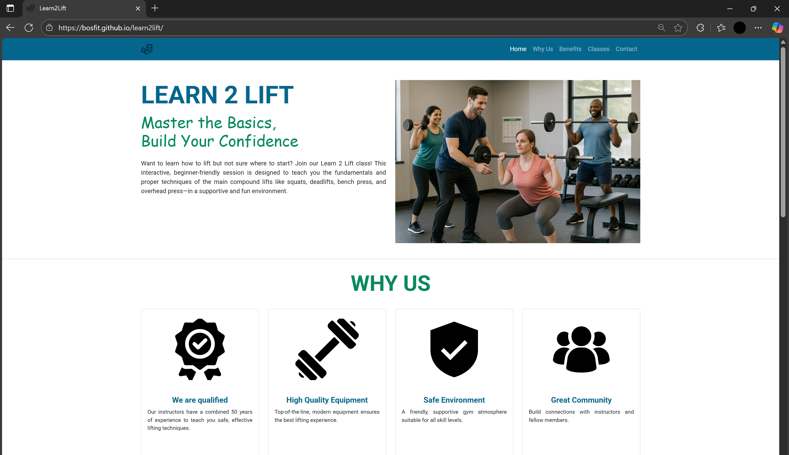
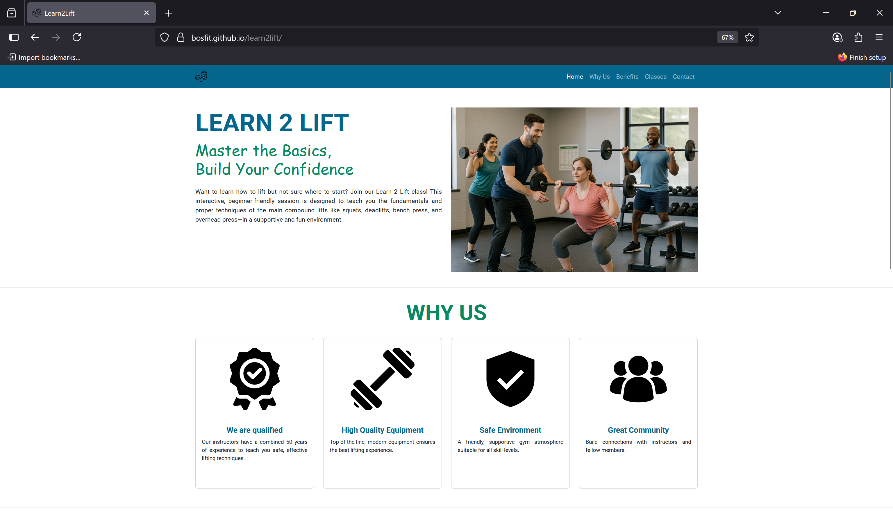

# Learn 2 Lift: Master the Basics, Build Your Confidence

Want to learn how to lift but not sure where to start? Join our Learn 2 Lift class! This interactive, beginner-friendly session is designed to teach you the fundamentals and proper techniques of the main compound lifts like squats, deadlifts, bench press, and overhead press—in a supportive and fun environment.

We break down each movement step-by-step, giving you hands-on guidance and practical tips you can use right away. You'll learn how to lift safely, avoid common mistakes, and build the foundation for long-term progress, all while connecting with others who are starting their own lifting journeys.

No experience or fancy gear required, just bring yourself and a willingness to learn! Whether you’re looking to get stronger, move better, or simply try something new, Learn 2 Lift is the perfect first step.

---

## Contents

- [User Goals](#user-goals)  
- [User Stories](#user-stories)  
- [Website Goals and Objectives](#website-goals-and-objectives)  
- [Target Audience](#target-audience)  
- [Wireframes](#wireframes)  
- [Design Choices](#design-choices)  
  - [Typography](#typography)  
  - [Colour Scheme](#colour-scheme)  
  - [Images](#images)  
  - [Responsiveness](#responsiveness) 
- [Features](#features)   
  - [Navbar](#navbar) 
  - [Header](#header) 
  - [Main Section](#main-section)
  - [Why Us Section](#why-us-section)
  - [Classes Section](#classes-section)
  - [Footer](#footer) 
  - [404 Page](#404-page)
- [Technologies Used](#technologies-used)  
  - [Languages](#languages)  
  - [Libraries & Framework](#libraries-framework)  
  - [Tools](#tools)  
- [Testing](#testing)  
  - [Bugs](#bugs)
  - [Responsiveness Tests](#responsiveness-tests) 
  - [Code Validation](#code-validation)  
    - [HTML](#html) 
    - [CSS](#css)  
  - [Accessibility Testing](#accessibility-testing)   
  - [Performance Testing](#performance-testing)  
  - [Browser Testing](#browser-testing)  
  - [User Story Testing](#user-story-testing) 
- [Deployment](#deployment)
- [Credits](#credits)    

---

## User Goals

- User-friendly navigation  
- Colour palette that reflects the site’s message and theme  
- Clear, concise information for easy understanding  
- Complete coverage of relevant content  
- A sense of community and belonging  

---

## User Stories

- As a user, I want to feel part of a community.  
- As a user, I want the website to feel welcoming, not intimidating.  
- As a user, I want to grasp the core message within 10 seconds.  
- As a user, I want information presented clearly and concisely.  
- As a user, I want intuitive, easy-to-use navigation.  
- As a user, I want the site to work well on any device.  
- As a user, I want the content to be accessible to people with diverse needs.  

---

## Website Goals and Objectives

- Present information in clear, easy-to-read formats  
- Attract a wide audience: beginners, casual lifters, parents, young people, etc.  
- Foster a community atmosphere that encourages sign-up  
- Provide accurate, useful content that keeps visitors engaged  
- Integrate high-accessibility features for diverse users  
- Improve search-engine rankings to increase overall traffic  

---

## Target Audience

- Beginners new to lifting  
- Gym goers looking for proper form  
- Young people seeking confidence in fitness  
- Parents wanting safe, structured workouts  

---

## Wireframes

Wireframes were designed using [Balsamiq tool](https://balsamiq.com/). I designed it in mobile version, tablet version, laptop version. It is one page website which focuses on alignment and clean design. The top part of the website looks the same throughout in terms of layout. I made sure due to having lots of boxes that it was responsive when it was viewed on mobile and tablet view.

  
Wireframe Desktop

 

  
Wireframe Tablet

  
Wireframe Mobile

---

## Design Choices

### Typography

We chose [Roboto](https://fonts.google.com/specimen/Roboto), a clean, sans-serif font with excellent readability. Its balanced letter spacing makes it ideal for both web and print.

### Colour Scheme

Our primary colour is a soft green to evoke wellness and approachability. All hues are cool-toned to maintain a calm, inviting feel rather than an aggressive one.

I had to change some of the colours because when I tested it on [WAVE Tool](https://wave.webaim.org/), I had some accessibility and contrast problems especially the green. I made the blue as the main colour and I changed the green from #6AB49C to #098960

### Images

Background and illustrative images (generated via ChatGPT) depict friendly group lifting with an instructor present. The cool tones harmonize with our colour palette and reinforce a fun, supportive environment.

Favicon icons and logo used are from [Flaticon](https://www.flaticon.com/free-icons) 

### Responsiveness

We use Bootstrap’s grid and custom media queries to ensure the layout adapts gracefully across all screen sizes:

---

## Features

Layout is easy to use and navigate. It is designed in a way that everything lines up and sections are split and displayed equally. Users can easily navigate between the different sections of the website and it is kept in the same format to keep it simple to understand with access to additional features like contact information.

The website is built on one page to make it easy to navigate with all the information one after the other to make it flow and easily accessible.

### Navbar

Navbar is responsive to different screen sizes with clickable features that takes you to a specific section on the website but keeps users on the same page.

  
Navbar Large Screen

  

  
Navbar Small Screen

  

### Header

Header includes the name of the class/brand, description and an image displaying what the class looks like. I designed it in a way that the user knew straight away within 5 seconds by looking at the header what the brand was, what it consist of and what to expect as well as adding text to persuade the user to join. In large screen, I wanted the text to be next to the image instead of displaying it underneath as I felt like it explained the text more having the image there. 

I tried to make sure that in large, medium and small screen that the title header, text and image all aligned together with equal padding for each. I justified the text so it aligns too.

  
Header Large Screen

  

  
Header Small Screen

  

### Main Section

The main section includes why us, benefits and classes sections. I made it similar and simple in terms of layout so it is easy to follow and kept it the same for each section so user knows what to expect for the next section. The only differences I made was the look itself where I used illustration for the why us to best represent the text, images for the benefits to show off the class and an overlay image for the classes section to make each section feel separate from the other, create their own identity.

In terms of layout, I tried again to align all the boxes together and in line with each other. I wanted to make the website to look very clean, professional and organised to represent the brand.

  
Main Section Large Screen

  

  
Main Section Small Screen

  

  
Main Section Small Screen 2

  

### Why Us Section

For the boxes surrounding the text and image, each section has their own padding. As you can see from the why us section, the large screen has a smaller bottom padding than when it is small screen and small screen has more bottom padding, that is due to adapting to the different mobile layouts like samsung, apple etc. As you can see, the Samsung phone layout will take more space within the box than an Iphone even though both bottom padding are the same.

  
Main Section Samsung Phone Screen

  

  
Main Section Iphone Screen

  

### Classes Section

The classes section contains buttons that takes you to a booking system website where users can book the class they would like. The buttons are clear and eye catching so the users are aware of them. There are 4 buttons, each taking you to that specific class instead of one button to help save time for the user and straight to the point.

  
Classes Booking Buttons

  

### Footer

I made the footer green toned to continue with blue and green toned theme and to separate to the above main section where I mostly used blue. The footer is very simple with their contact information and opening times.

  
Footer Large Screen

  

  
Footer Small Screen

  

### 404 Page

In the case of a link or page not working. I designed a 404 page that will display the clear message of it not working and also a button that takes you back to the home page.

  
404 Page

  

---

## Technologies Used

### Languages

- HTML
- CSS
- JS

### Libraries & Framework

- [Bootstrap](https://getbootstrap.com/)
- [Google Fonts](https://fonts.google.com/)
- [Flaticon](https://www.flaticon.com/free-icons)  

### Tools

- [Github](https://github.com/)
- [Balsamiq](https://balsamiq.com/)
- [W3C HTML Validation Service](https://validator.w3.org/)
- [W3C CSS Validation Service](https://jigsaw.w3.org/css-validator/)
- [Responsive Design Checker](https://responsivedesignchecker.com/)
- [WAVE Tool](https://wave.webaim.org/)
- [Page Speed Insights](https://pagespeed.web.dev/)

---

## Testing

### Bugs

The website was thoroughly tested by using the console logs to ensure within Google to ensure if there are any errors, as shown in the image below, you can see that there are no bugs or errors.

### Responsiveness Tests

To test the responsiveness, I tested the deployed versions of the website using external website [Responsive Design Checker](https://responsivedesignchecker.com/) and looked at how the website looks within different devices and sizes. Below is the result.

  
Responsiveness Big Screen

  

  
Responsiveness Medium Screen

  

  
Responsiveness Small Screen

  

Final Test Results

| Size | Device Example         | Navigation | Element Alignments | Content Placement | Functionality | Notes                                                        |
|------|-----------------------|------------|--------------------|-------------------|---------------|--------------------------------------------------------------|
| sm   | Samsung Galaxy S6     | Good       | Good               | Good              | Good          | Updated font size of the why us area to fit inside the box   |
| sm   | iPhone 6              | Good       | Good               | Good              | Good          | Updated font size of the why us area to fit inside the box   |
| sm   | iPhone 13 PRO MAX     | Good       | Good               | Good              | Good          |                                                              |
| md   | iPad MINI             | Good       | Good               | Good              | Good          |                                                              |
| md   | Galaxy Tab S7         | Good       | Good               | Good              | Good          |                                                              |
| md   | iPad Air              | Good       | Good               | Good              | Good          |                                                              |
| lg   | iPad Pro              | Good       | Good               | Good              | Good          |                                                              |
| xl   | Mackbook Air          | Good       | Good               | Good              | Good          |                                                              |
| xl   | HP Stream Laptop      | Good       | Good               | Good              | Good          |                                                              |
| xxl  | Dell Lattitude        | Good       | Good               | Good              | Good          |                                                              |
| xxl  | Desktop               | Good       | Good               | Good              | Good          |                                                              |

### Code Validation

#### HTML

I used [W3C HTML Validation Service](https://validator.w3.org/) to test my HTML files.

I tested my index.html file and it came back with some errors and warnings, mainly in regards to my main element as shown below.

Below is the updated version after I fixed the errors. I’ve redesigned the code to make sure all of my page content under a single main element and removed the extra main tags. The Benefits and Classes sections now live inside that one main, separated by hr's tags. Each section retains its unique id (whyus, benefits, class-section), so there are no duplicate IDs.

#### CSS

I used [W3C CSS Validation Service](https://jigsaw.w3.org/css-validator/) to test my CSS files.

I tested my style.css file and it came back with no errors.

### Accessibility Testing

I used the [WAVE Tool](https://wave.webaim.org/) to test my website and to tell me if web content on my website is accessible to individuals with diverse needs.

No big errors were raised but there were some contrast errors and alerts displayed.

I made some changes to my code and layout of the website to reduce or get rid of the errors and alerts that I got as shown below. I changed the colours of the footer and some of the buttons to primary colour to improve the contrast of them. I changed the RGB of the secondary colour to improve the contrast as the headings had contrast errors which now it is fixed.

Below shows the results for desktop and mobile. As you can see the desktop only has 4 contrast errors now which is mostly the navbar page text which the mobile does not have that problem.

### Performance Testing

I used [PageSpeed Insights](https://pagespeed.web.dev/) to test the performance of my website that includes accessibility, best practices and SEO for both mobile and desktop.

The accessibility, best practices and SEO have came back all green but the performance came back with amber. The desktop has a 87 performance and mobile has 69 performance.

Below is the screenshot of the stats and the some of the components that have reduced the performance of the website in desktop and mobile.

  
Performance Testing Desktop

  

  
Performance Testing Mobile

  

I would like to improve the performance of my website on desktop and mobile but unfortunately it is out of my skills reach at the moment to fix the problems so I will leave it at amber which doesn't affect much of the website as everything still works at a good standard.

### Browser Testing

The Learn2Lift website was viewed and tested for bugs using a variety of browsers. I tested the website using Firefox, Google Chrome, and Microsoft Edge. I checked the console logs for each which there are not problems with it. The layout and look of the website on each browser looks good with no differences or problems.

  
Browser Testing Chrome

  

  
Browser Testing Microsoft Edge

  

  
Browser Testing Firefox

  

### User Story Testing

- As a user, I want to feel part of a community. 
  - Did I achieve it? YES
  - How? Community and meeting new people was mentioned a few times on the website alongside pictures of people in a group.

- As a user, I want the website to feel welcoming, not intimidating.  
  - Did I achieve it? YES
  - How? I made sure the website was easy to follow and straight to the point without using words or terms that beginners may not know about fitness and communicated in a way that show people of all skills can join.

- As a user, I want to grasp the core message within 10 seconds.  
  - Did I achieve it? YES
  - How? I made sure the website had a tag line, description and image in the header that explained what the website was about in a clear and concise way.

- As a user, I want information presented clearly and concisely. 
  - Did I achieve it? YES
  - How? I made sure the website had text displayed in an organised way and easy to read. Made sure each part was split up instead of everthing together, easier to follow.

- As a user, I want intuitive, easy-to-use navigation.
  - Did I achieve it? YES
  - How? I made sure the website was easy to use by making each part of the website follow the same layout and theme so it looks the same and the user will know what to expect and designed everything on one page so all the information was displayed on one page. 
  
- As a user, I want the site to work well on any device.  
  - Did I achieve it? YES
  - How? I tested the website using [Responsive Design Checker](https://responsivedesignchecker.com/) and I didn't have any problems.

- As a user, I want the content to be accessible to people with diverse needs.  
  - Did I achieve it? YES
  - How? I tested the website on [WAVE Tool](https://wave.webaim.org/) and didn't get any major errors and only 4 contrast on desktop and not mobile. The 4 contrast errors will not affect the viewing of the website.

  ---

## Deployment

The Learn2Lift website was deployed early in the process to GitHub pages via the following steps:

Navigate to the repository on GitHub and click on Settings.

In the side navigation and select Pages.

In the None dropdown and choose Main.

Click on the Save button.

The website is now live at [Learn2Lift](https://bosfit.github.io/learn2lift/)

Any changes required to the website, they can be made, committed and pushed to GitHub.

  ---
  

## Credits

I would like to thank Thomas Cowen and Simen Daehlin for their advice and support as well as the members in my class group.